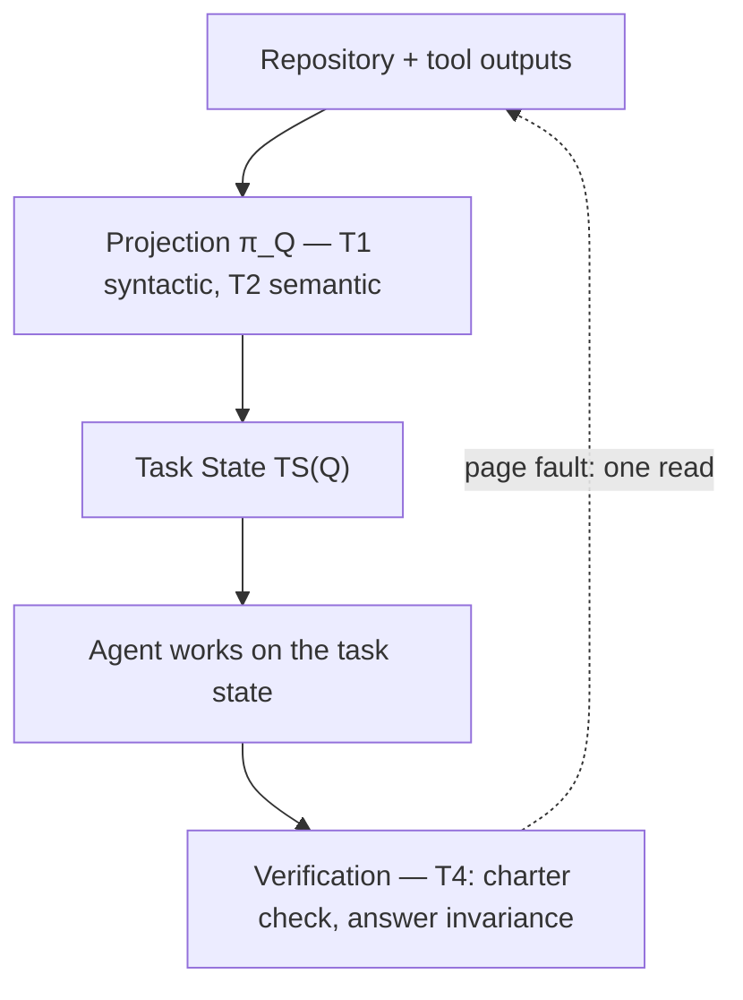
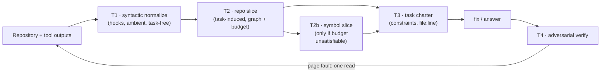
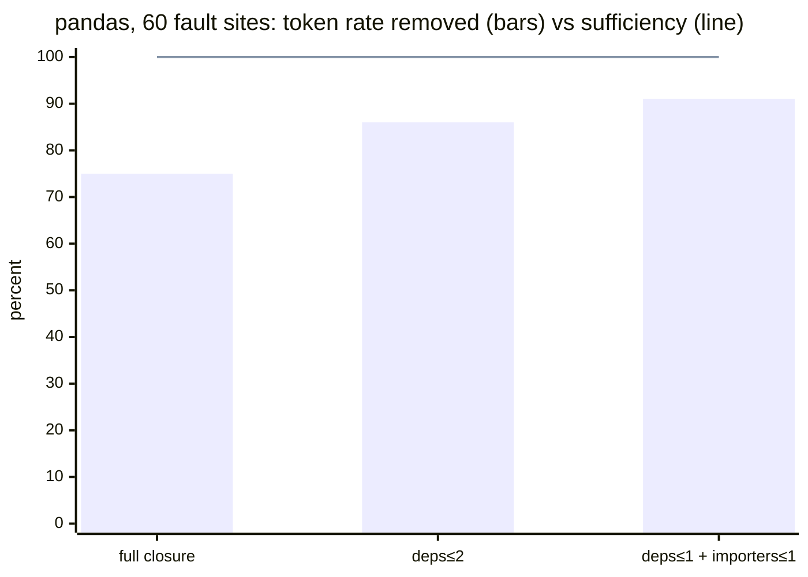
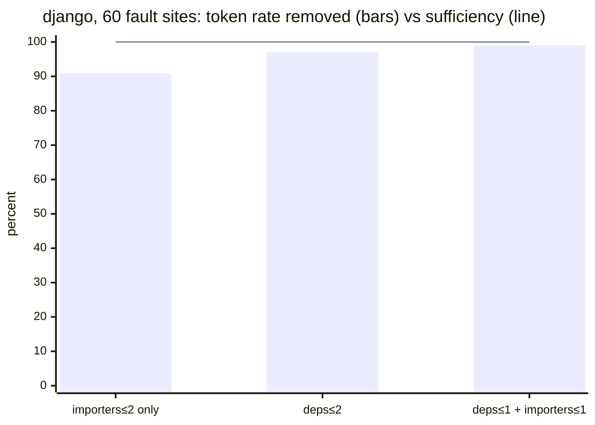

# context-kernel

[](https://github.com/Pinperepette/context-kernel/actions/workflows/ci.yml)
[](https://github.com/Pinperepette/context-kernel/tags)
[](https://github.com/Pinperepette/context-kernel/blob/main/LICENSE)

-52514e)

<p align="center">
  
</p>
<p align="center"><em>Via selectionis: of everything the repository affords, only the
task-indexed path is lit. The rest is not deleted — it remains as roots,
<strong>omnia possibilia</strong>, one page fault away. Solum quod refert, manet.</em></p>

**Context engineering for Claude Code, Codex and AI coding agents:
task-induced context optimization with measured answer preservation.**

context-kernel is an open-source **context engineering framework** for coding
agents: repositories and tool outputs get projected onto **task-equivalent
working sets**, cutting token usage — measurably — without changing what the
agent can answer.

Modern coding agents waste most of their context window on information that is
irrelevant to the current task. context-kernel — a native **Claude Code
plugin**, with a Pi port, a Codex fallback and **MCP** tools any AI coding
assistant can call — reduces that context while preserving the agent's ability
to solve the task: the repository is projected onto *a representative of its
equivalence class with respect to the task*. Deterministic, stdlib-only, zero
API keys — and every claim below is measured, not estimated, and reproducible
from this repository.

- **−79% tokens end-to-end** on a complete real Claude Code session — every
  tool output the session produced, not a single-command microbenchmark
  ([details](#4-measured-results))
- **100% sufficiency** on two 60-case fault benchmarks (pandas, 1.4k files;
  Django, 3k files): token optimization is worthless if the answer dies — here
  the answer's survival is *measured*
  ([what we measure](#what-we-measure-rate-and-distortion))
- **406 tests** (402 pure-stdlib Python + 4 Pi bridge), CI on Linux, Windows
  and macOS
- **Zero dependencies, zero API calls** — verification runs in-session

> "There is no such thing as *the* context" is not a slogan: there is no
> **task-independent** context. A context only exists with respect to a task,
> and the task is what induces the projection
> ([the model](#1-mathematical-foundation-of-task-induced-context-projection)).
> context-kernel is one implementation; the underlying idea —
> **task-induced context projection** — is independent of Claude Code and
> applies to local or hosted coding agents alike.

> This is not compression. gzip makes text smaller and unreadable;
> normalization maps a context to a canonical, smaller member of the same
> answer-equivalence class. The output is still code, still readable, still
> sufficient — by construction where possible, by measurement everywhere else.

## Quick example

One real measured case (Django, from the sufficiency benchmark):

```text
Repository: Django — 2,972 source files
        │
        ▼   task-induced projection  (the symptom: one traceback)
Task state: 44 files  (−98.5% of the repository)
        │
        ▼
Agent solves the same bug — sufficiency verified: the raise site
is in the working set for 60/60 real fault cases
```

The whole project is this arrow, made deterministic, measured, and safe to
rely on ([how](#how-task-induced-context-projection-works)).

## Get started in 60 seconds

Claude Code, native plugin — no API key, no config, nothing to sign up for:

```text
/plugin marketplace add pinperepette/context-kernel
/plugin install context-kernel
```

The hooks now normalize tool outputs automatically. You'll see a
`[context-kernel: …]` footer on long outputs and the cumulative savings in the
status line; confirm it's live with `/hooks` and `/plugin`.

**First real result — project a repo onto one bug.** In any repo, paste a
traceback or error into your prompt: the T2 hook detects it and injects the
repository *slice* for that symptom — the files that can matter (seeds from the
stack frames, their dependency closure, the callers, related tests), with
everything it excluded **declared as a recoverable page fault, not a deletion**.
Prefer to call it explicitly? The plugin ships the `kernel_repo_slice` **MCP
tool** and the `/kernel-repo-slice` **skill**; every AI assistant that speaks
MCP can use it.

Full install options — Pi, Codex, manual `install.sh`, Windows notes — are in
[§7 Installation](#7-installation).

<picture>
  <source media="(prefers-color-scheme: dark)"
          srcset="https://raw.githubusercontent.com/Pinperepette/context-kernel/main/docs/savings-live-dark.svg">
  
</picture>

*Figures regenerate from real data with `python3 docs/charts.py` — this one
reads your own `~/.context-kernel-savings.log`.*

## Why context engineering matters

Context engineering is becoming one of the main bottlenecks for coding agents:
the context window is the scarce resource, and filling it with task-irrelevant
tokens degrades cost and answer quality at the same time. context-kernel
addresses this problem by projecting repositories and tool outputs onto the
smallest task-equivalent representation — context optimization that is
verified, not hoped for
([how](#how-task-induced-context-projection-works),
[why it's different](#what-makes-it-different)).

## Features

The core, in five bullets:

- **Task-induced context projection** — the repository becomes a small task
  state ([the model](#1-mathematical-foundation-of-task-induced-context-projection),
  [the operators](#2-the-four-operators))
- **Repository slicing** from real symptoms — stack traces, error literals,
  git diffs — via deterministic dependency-graph codebase analysis
- **Context normalization** of tool outputs (dedup, re-read deltas,
  grep-aware and JSON-aware MCP projection) — ambient token optimization on
  every tool call
- **Answer-preserving verification** — application canary, sampled A/B
  answer-invariance, an objective sufficiency oracle
  ([the canary](#5-the-canary-measuring-effect-not-intent))
- **Zero dependencies** — stdlib-only, no API keys, no index to maintain

Beyond the core, same discipline:

- **Symbol-level slicing** for monolithic files (−96% below the file-level
  floor on pandas)
- **Automatic token budgeting** derived from the live context window
- **Task charter extraction** with an active guard on edits and shell writes
- **Page-fault recovery** — every exclusion is a prior, not a prohibition
- **Live telemetry** — savings ledger, statusline, revealed-relevance mining
- **Every language covered** — precise import graphs for Python/JS/PHP/Go, a
  declared generic floor for ~27 more extensions
  ([the gate rule](#22-language-coverage-and-the-gate-rule))

## What we measure: rate and distortion

Every projection trades **rate** (how many tokens are removed) against
**distortion** (whether the answer changes). Most context optimization tools
report only the first number. context-kernel measures both: rate from the
savings ledger and the manifests; distortion through an objective sufficiency
oracle on real fault sites, an application canary, and sampled A/B
answer-invariance judgments ([measured results](#4-measured-results)).

## Measured results at a glance

**Measured. Not estimated. Reproducible** — every row from this repository
([full details, charts and commands](#4-measured-results)):

| Corpus | Files | Reduction | Sufficiency |
|---|---:|---:|---|
| pandas (file-level slice) | 1,415 | −75% … −91% | **100%** (60/60 fault sites) |
| pandas (symbol-level, $T_{2b}$) | 1,415 | −96% | method-exact slices |
| Django (file-level slice) | 2,972 | −91% … −98.5% | **100%** (60/60 fault sites) |
| lodash (real JS stack) | 1,048 | −97% | all 4 frames kept |
| ripgrep (generic floor, Rust) | 104 | −31% | declared weaker class |
| one full Claude Code session | — | **−79% end-to-end** | task completed |
| real ephemeral tool outputs, park dividend on | 7,707 outputs | **−44.8%** (vs −31.9% baseline) | 0 signal lines lost in either arm |
| rich — full pipeline on a real upstream bug, blind protocol | 190 | **−99%** (2-file slice under auto budget) | fix written from the slice alone: charter 8/8, 0 page faults, suite green |
| gjson (Go) — full pipeline on a real upstream panic (#192), blind protocol | 1 file, 3,650 lines | **−58%** (symbol slice of a monolith) | Go stack frames → symbol slice `squash`+3 fns; fix written from the slice alone, **byte-identical to upstream** `f0ee9eb`; suite green, upstream `TestIssue192` passes |
| celery — dynamic-reference resolver on a real DI framework | 425 | — (completeness, not reduction) | static graph seeded at `bin/shell.py` **misses** `concurrency.eventlet`/`gevent` (dynamic-only imports); `CK_DYNREF` **recovers both as seeds with their call sites** (+ transitive deps); non-literal (`registry.py:67`) and external (`django.db`) args **declared as blind spots, never guessed** |
| Django **hard**, multi-hop bench (n=5) | 2,972 | −12% tokens, −29% calls, −38% time | **correctness tie** — 3/5 in *both* arms: a **cost** win, not a correctness one, and **not monotone** (one case where the manifest misled) |
| A/B answer-invariance, sampled on **live traffic** | 153 elisions | — | **4 invariant / 3 degraded**; all 3 degradations are Bash outputs whose repetitive *shape* hid the signal (a symbol-name list, a diff hunk header, a numeric step sequence) — **never a file read**; each named shape is now recognized by the Bash signal predicate, with regression tests ([§10](#10-guarantees-and-limits-honestly)) |

The **−79% is an end-to-end session measurement**, not a microbenchmark: it
sums every tool output a complete real session produced — repository reads,
repeated reads, greps, web fetches, MCP results, slices — before vs after
normalization. Conversation messages are never touched by the kernel, so they
sit outside both sides of the ratio: the operators act on what the tools
inject into the context window, and that is where the redundancy lives.

The last two rows are the honest counterweight, and they say **when it is worth
it**. The clean wins are on **structured code and file reads**. On a **hard,
multi-hop** task the edge is real but it is a *cost* win — fewer calls, tokens
and time at **equal correctness** — not a correctness win, and it is not
monotone: the slice can occasionally mislead. The live A/B says the same from
the compression side: where normalization degrades, it degrades on **Bash
outputs whose form looks like noise but is the answer** — exactly what `# ck:raw`
and the auto-degrade canary exist to catch. Rule of thumb: **lean on it for
code and repo slicing; keep an eye on it for shape-heavy shell output.**

## What makes it different

| Existing systems | context-kernel |
|---|---|
| retrieve relevant documents | choose a small *equivalent context* |
| compression | projection |
| heuristic ranking | task-induced projector $\pi_Q$ |
| hope the answer survives | **measure** answer preservation |

| Approach | Task-aware | Deterministic | Answer preservation | Failure mode |
|---|---|---|---|---|
| Naive truncation | no | yes | none | silent signal loss |
| Summarization | weakly | no | unmeasured | paraphrase drift |
| Embeddings / RAG retrieval | query-aware | no | unmeasured | similarity ≠ relevance for code |
| **context-kernel** | **yes ($\pi_Q$)** | **yes** | **measured** (oracle + canary + A/B) | **declared**: visible markers + page fault |

### What this is not

- **not a RAG system** — nothing is retrieved by similarity into the prompt
- **not a summarizer** — no paraphrase ever replaces source code
- **not a prompt optimizer** — prompts are untouched; the *context* is projected
- **not an embedding retriever** — for code, reachability beats similarity
  (measured: [§4](#4-measured-results))

It is a **task-induced projection system** with measured answer preservation.

## Use cases for AI coding agents

- **Claude Code** — native plugin: hooks, skills, agents, MCP server
- **Codex and other harnesses** — fallback glue, plus a
  [bridge contract](https://github.com/Pinperepette/context-kernel/blob/main/pi/BRIDGE.md)
  to port any AI agent harness in ~100 lines
- **Large monorepositories** — automatic token budgeting + symbol-level slicing
- **AI-assisted debugging** — a traceback in the prompt injects the working
  set by itself
- **Code review / pull request review** — `--from-diff` turns a PR into a
  working set with blast radius and related tests
- **Bug fixing** against an extracted, actively-guarded task charter
- **Repository exploration** under a token budget, with page-fault recovery

## How task-induced context projection works



---

## 1. Mathematical foundation of task-induced context projection

*(The framing owes a debt to the operator-theoretic language of spectral theory —
projections, kernels, decompositions. It is an analogy used with care, not a claim
of isomorphism.)*

### 1.1 The answer map induces an equivalence

Let $X$ be the space of possible contexts and $Y$ the space of answers. An agent
solving a task $Q$ is a map

$$A_Q : X \longrightarrow Y$$

$A_Q$ induces an equivalence relation on contexts:

$$x \sim_Q x' \iff A_Q(x) = A_Q(x')$$

This is the load-bearing observation: **there is no such thing as "the"
context.** There are infinitely many representations equivalent under the task.
The agent does not need the document — it needs *any representative of the
document's equivalence class* $[x]_Q$. Normalization means choosing a small one.

### 1.2 Task-induced projectors

A **task-induced projector** is a map $\pi_Q : X \to X$ that is

- **idempotent**: $\pi_Q(\pi_Q(x)) = \pi_Q(x)$ — normalizing twice changes nothing;
- **answer-preserving**: $A_Q(\pi_Q(x)) = A_Q(x)$, i.e. $\pi_Q(x) \in [x]_Q$.

The subscript is not decoration. Change the question and the kernel changes:
what is invisible to "fix this KeyError" may be load-bearing for "audit the
license headers". A projector without a task index is either trivial or wrong.

Everything $\pi_Q$ removes lies in the **kernel of the task**,

$$\ker Q \ = \ \{\ \delta \in X \ : \ A_Q(x + \delta) = A_Q(x)\ \ \forall x \ \}$$

— the part of the context that cannot move the answer.

### 1.3 Two kernels: syntactic and semantic

The kernel splits into two parts of very different nature:

$$\ker_{\mathrm{syn}} \ = \ \bigcap_{Q} \ker Q \qquad\subseteq\qquad \ker Q$$

- **Syntactic kernel** — invisible to *every* task: ANSI escapes, progress-bar
  spam, consecutive duplicate lines, a file re-read that is byte-identical to
  the copy already in context. Because $\ker_{\mathrm{syn}}$ does not depend on
  $Q$, it can be projected away **ambiently**, by a hook that never needs to
  know what you are working on. That is exactly what $T_1$ is.
- **Semantic kernel** — invisible to *this* task: the 1,404 pandas files that a
  `merge` KeyError cannot see. This is the hard part; it requires knowing $Q$.
  That is what $T_2 \ldots T_4$ are for.

This dichotomy is why the architecture has the shape it has: task-independent
normalization runs everywhere and always; task-induced normalization runs when
there is a symptom to induce it.

### 1.4 The Task State

Define the **task state**:

$$\mathrm{TS}(Q) \ := \ \pi_Q(C)$$

the canonical small representative of $[C]_Q$. The agent never works on the
repository; it works on the task state. Concretely, $\pi_Q$ is factored through
four operators:

$$\mathrm{TS}(Q) \ = \ \big(T_4 \circ T_3 \circ T_2 \circ T_1\big)(C)$$

In the continuous (embedding-based) picture, $Q$ spans a subspace
$\mathrm{span}(Q)$ generated by relevance probes, and each context unit $u$ is
scored by how much of its energy lives inside it:

$$\mathrm{score}(u) \ = \ \frac{\lVert \pi_Q\, e(u) \rVert}{\lVert e(u) \rVert} \ \in \ [0,1]$$

The discrete, exactly-computable picture replaces embeddings with
**reachability on the dependency graph** — which is what the shipped operators
use, because for code, structure beats similarity (we measured it; see §6).

### 1.5 Composition of projectors

When is $\pi_2 \circ \pi_1$ still answer-preserving? If both were
answer-preserving *globally*, composition would be trivial:
$A_Q(\pi_2(\pi_1 x)) = A_Q(\pi_1 x) = A_Q(x)$. The real content is that each
practical operator preserves answers only **under premises** — $T_2$'s
soundness assumes the import graph is computed from the *true* sources. So the
composition law is:

> $\pi_2 \circ \pi_1$ is answer-preserving iff the premises of $\pi_2$ hold on
> $\mathrm{Im}(\pi_1)$.

Order matters through the premises, not through the algebra. Concretely: run
$T_1$ (output normalization) *before* $T_2$ (graph slicing) and nothing breaks,
because they act on **different factors** of the context space,

$$C \ = \ C_{\mathrm{repo}} \times C_{\mathrm{dialogue}}, \qquad
T_1 = \mathrm{id} \otimes \tau_1, \quad T_2 = \tau_2 \otimes \mathrm{id}$$

and projectors on different tensor factors **commute**. Run a $T_1$-style
truncation on the *sources* before $T_2$, and $T_2$'s premise dies — which is
why this plugin never does that.

Two structural facts worth stating plainly:

- Answer-preserving projectors (with compatible premises) form a **monoid**
  under composition — closed, associative, with identity.
- They do **not** form a group. There is no $\pi_Q^{-1}$: the inverse of a
  projection is not an operator — it is an *access path*. That is the
  **page fault** (§1.6).

### 1.6 The honest weakening: page faults

Perfect answer-preservation cannot be guaranteed by static analysis alone
(dynamic imports, dependency injection, config indirection). So the guarantee
this plugin actually makes is deliberately weaker and *checkable*:

$$A_Q(\pi_Q(C)) = A_Q(C) \quad\textbf{or}\quad \text{the miss is detectable and repairable}$$

Every exclusion is a **prior, not a prohibition**. The manifest declares what
was projected away; if the agent needs an excluded piece, recovering it costs
one read — a page fault, in the OS sense. The interesting quantity is then not
"was the projection perfect?" but "what did the faults cost?" — and that is
logged, per run.

### 1.7 Rate–distortion

Every normalization trades **rate** (fraction of tokens removed) against
**distortion** (probability the answer moved out of its class). Both are
measured:

- **rate** — from the manifests and the savings log;
- **distortion** — via an *objective oracle*: take real fault sites in a repo
  (actual `raise` statements), synthesize the partial symptom a user would
  report (the caller's frame plus the error message, **not** the raise site
  itself), and check whether the projection keeps the raise site in the task
  state. If the file that throws is projected away, the answer changes with
  certainty.

Distortion is also **predicted per run, deterministically** — not only measured
after the fact by the offline oracle or in production by the fault ledger. The
**sufficiency oracle** compares the returned projection $P$ against the
answer-preserving closure $R$ of the seeds (their full backward dependency set on
the static graph): $P \supseteq R \Rightarrow$ *sufficient*; otherwise $R
\setminus P$ is exactly the set of **expected page faults**, declared by name in
the manifest. This is the "sufficient context" idea (Yu et al., *Sufficient
Context*, ICLR 2025) but **computed rather than judged by a model** — and it is
the abstention signal made exact: when the slice is insufficient the manifest
tells the agent *where* to page-fault instead of leaving it to guess. It is a
measurement (T4), never a change to $\pi$.

Where the sufficiency oracle *predicts* distortion statically, **delta
debugging** (`hooks/ddmin.py`, Zeller & Hildebrandt) *proves* the minimum by
running: given a reproduction and a pass/fail oracle, it isolates the
**1-minimal** input that still reproduces — the empirical rate–distortion
optimum on the *query* side (the tightest $Q$ at zero distortion). A minimized
repro feeds a tighter, more precise slice back into $T_2$.

The curve lives in `~/.context-kernel-pipeline.jsonl`, one JSON row per run.

---

## 2. The four operators

| | Operator | Kernel it targets | What it does | Guarantee |
|---|---|---|---|---|
| $T_1$ | **normalize** (impl. `compress.py`) | syntactic | Signal-preserving normalization of tool outputs (dedup, ANSI/progress strip, head+signal+tail elision). Plus **re-read deltas** (unchanged re-read → 3-line marker; changed file → unified diff against the copy in context), **command deltas** (the same Bash command with identical output → marker), **output parking** for ephemeral results (an elided Bash/MCP/WebFetch output can't be page-faulted by re-reading a file — the command already ran; so the full original is parked on disk at elision time and the footer declares the *targeted* recovery: `recall.py KEY --grep/--lines` returns only the lines you ask for, deterministically — the projection's inverse finally exists for ephemeral context too, and `recall.py --search REGEX` makes that inverse **navigable across the whole session** (a MemGPT-style *recall storage*: grep every parked output at once, then page in the one that matched — the access path made searchable, still no ranking, no model); and the inverse pays a **dividend**: because recovery is guaranteed, the elision rate on exactly the parked tools is more aggressive by construction (`CK_EPHEMERAL_SCALE` 0.5, auto-off when parking is off) — measured on 7,707 real ephemeral outputs: −44.8% vs −31.9% baseline, ~460k extra tokens, zero signal lines lost in either arm, `bench/ephemeral_dividend.py`), **grep-aware projection** (matches grouped per file, first K kept, the rest becomes counts — no file is ever dropped), **outline-first giant reads** (a Python file above ~20k tokens arrives as signatures with exact line ranges; bodies are fetched per symbol via offset/limit), **prose projection** for WebFetch (nav/link runs collapse), a **JSON projection** for MCP tool outputs (long homogeneous object arrays → first K samples + key schema + count; the schema is the syntactic kernel of the structure — paying it N times is redundancy; repeated identical MCP calls get the same delta/page-fault mechanics as Bash commands), an **adaptive rate** that works from the first token (baseline scale 0.75 — a young session is not an excuse for lazy compression) and tightens further to 0.5 as the context window fills (60%→90%, from the live usage tracker), and **learned per-category rates** closing the $T_5 \to T_1$ loop: `revealed.py --apply-rates` (an explicit human command, never silent tuning) writes per-extension rates from *recurrent measured page faults* — a category that repeatedly cost re-reads gets lighter compression (`relax`) or untouched pass-through (`raw`). Relax-only by construction: the absence of faults never tightens anything, because a fault is visible only when the model actually re-read. | Signal lines (errors/warnings) always survive; every elision leaves a visible marker; a **canary** verifies each replacement was actually applied (§4) |
| $T_2$ | **repo slice** | semantic | Projects the repository onto the working set induced by the symptom: seeds from stack frames / quoted literals, dependency closure, bounded importers, related tests. Import graphs for **Python, JS/TS, PHP and Go** (PHP: `use`/`namespace`/group-`use`/`require` edges via a declaration-derived FQCN map, fatal-error and `file.php(N)` frames as seeds and ambient strong symptoms; Go: package-level edges from the `go.mod` module path — importing a package pulls its directory, `_test.go` files arrive only as related tests, goroutine-dump frames seed, and without a `go.mod` internal imports are declared unresolvable rather than guessed). Every other source language (~27 extensions: Rust, Java, Ruby, C/C++, C#, Swift, Kotlin, …) gets the **generic mention graph** — filename-literal + unique-stem references, edges labeled `[grafo generico]`, weaker class declared in the manifest (§2.2: the gate rule) — **promoted to precise edges when the repo ships a ctags `tags` index** (`CK_CTAGS`, default on): a file citing a *uniquely* defined symbol gets a real symbol→definer edge, recovering dependencies the filename heuristic can't see; the SCIP idea (consume an existing index) with **zero dependencies** (SCIP is protobuf, ctags is text); ambiguous symbol → skipped, additive only (edges added, never removed). Token **budget** (auto-derived from the live context window) selects the richest closure that fits; on monolithic repos it descends to **symbol level** ($T_{2b}$). A slice can also be seeded from a **git diff** (`--from-diff REF`, e.g. `main...` for a PR): the changed source files become seeds and the same graph returns the *review* working set — dependencies, importers (the blast radius), related tests. **Learned priors** from $T_5$ (`revealed.py --write-priors`, recurrence ≥2 only) feed back in: recurrently-read-outside files become extra seeds with a declared why, never-opened slice files get a `[freddo T5]` flag — additive and declarative only, never an exclusion. A **git co-change prior** (`CK_CHURN`, default on) adds the cold-start signal T5 lacks on a fresh repo: files that historically change *in the same commits* as the seeds (evolutionary coupling, recurrence ≥2) become extra seeds with a declared why — additive, never an exclusion, never a slice on its own. A **coverage prior** (`CK_COV`, default on) consumes a test-run artifact if the repo ships one (`.coverage` SQLite, `coverage.xml` Cobertura, `lcov.info` — all parsed with the stdlib, zero deps): files that *actually executed* but lie outside the seeds' static closure are the **dynamic reachability the graph can't see** (DI, reflection, config indirection) and become extra seeds — additive, never an exclusion; when the artifact is too broad (whole-suite, not the failing scenario) the count is declared as a page-fault hint rather than seeded blindly. A **supervised dynamic-reference resolver** (`CK_DYNREF`, default on) scans the seed files for `importlib.import_module`/`__import__`: a *literal* argument resolvable to a repo file becomes a seed with its call site (recovering a module the static graph can't see), a non-literal or unresolvable one becomes a declared blind spot — additive too, never guessed. An optional **`--anchor-ends`** reorder (off by default) fights the *lost-in-the-middle* attention curve: the seed stays at the head and the importers/callers (where the cause may live) rise to the tail, so both attention-hot extremes carry causal signal while the related tests — repro, not cause — sink into the middle; **ordering only, never selection** — the identical set of files, permuted, safe for $\pi$. | Sound on the static import graph, with literal dynamic imports recovered and the rest declared; blind spots are declared exclusions + page faults; a deterministic **sufficiency verdict** flags whether the projection equals the answer-preserving dependency closure or, under budget, names the dropped units as expected page faults; results cached by repo fingerprint **and operator hash** |
| $T_3$ | **task charter** | semantic | Extracts the constraints the fix must respect — contracts, invariants, behaviors pinned by tests — each with a mandatory `file:line` citation, ≤ ~10 items. Saved via `charter.py` it becomes **active** — and citations don't rot: at save time each citation captures an *anchor* (the cited line's content), and `charter.py refresh` re-resolves drifted `file:line` numbers deterministically — a unique anchor match updates state *and* text, zero or ambiguous matches are declared unresolvable, never guessed (the FQCN rule again): a PreToolUse guard injects the relevant constraints right before any Edit/Write of a cited file (the charter goes from post-hoc checklist to live invariant), and the charter survives auto-compaction (§2.1). Guard contract verified live: the harness honors `additionalContext` on PreToolUse — constraints reach the model before the edit, TTL dedup confirmed. The guard also watches **Bash**, closing the shell loophole: a command matching a known write pattern (`sed -i`, `perl -i`, `tee`, redirects, `mv`/`cp`/`rm`, `truncate`, `dd of=`, `git checkout/restore`) that names a cited file gets the same constraints injected *before it runs* — conservative by design (closed pattern list + cited file required; a false negative beats noise on every `ls`). | Every claim is citable; a stale citation is detectable; the guard indexes only cited constraints — the skill's rule made mechanical |
| $T_4$ | **verifier** | — (checks, does not project) | Adversarial check of the fix against the charter, constraint by constraint; or answer-invariance judgment $A_Q(x) \overset{?}{=} A_Q(\pi_Q(x))$. Plus **empirical minimality** (`hooks/ddmin.py`, delta debugging à la Zeller): given a reproduction and a pass/fail oracle you supply, it isolates the **1-minimal** input that still reproduces — the operational twin of the (static) sufficiency oracle: sufficiency *predicts* distortion, ddmin *proves* the minimal query by running. A minimized repro is a tighter $Q$ → a more precise slice. Opt-in (needs a runnable oracle), deterministic, stdlib. | Reads ground truth via `sed`/`awk`, never through its own (normalized) Read tool |



### 2.1 Defending the Task State

Three events can silently invalidate $TS(Q)$, and all three are handled:

- **Auto-compaction** is a projection *not indexed by the task* — exactly the
  "projector without a task index" the formalism warns about. It cannot be
  prevented, but $TS(Q)$ can be defended: a PreCompact hook snapshots the
  active charter ($T_3$) and the head of the current working-set manifest
  ($T_2$); the SessionStart hook re-injects them when the session resumes from
  a compaction. The post-compact session restarts from the task state, not
  from a generic summary. Verified live on a real `/compact`: the post-compact
  brief carried the full active charter. A companion **scheduler** decides
  *when* the cheaper manual `/compact` is worth pre-empting the automatic one:
  instead of a fixed occupancy ratio, the advisory threshold is **modulated by
  the measured cost of dropping context**. `lifetime.py` reads the survival
  curve straight from the fault ledger (`~/.context-kernel-faults.log`) — an
  empirical histogram over the log the plugin already writes, not a clock-TTL
  table (a stack trace dies when the bug is fixed, not after 30 wall-clock
  seconds): when recent elisions keep re-entering (context still *alive*) it
  advises later, when they don't (context *dead*) it advises sooner. The shift
  is bounded to a narrow band around the operator's base (a pathological
  estimate moves the threshold by at most ±0.12, never to an absurd value), it
  is **timing only** — the $T_1$ compression rates are untouched (the $T_5$
  invariant: learned signals only *relax*) — and it is advisory anyway, with
  the PreCompact snapshot defending $TS(Q)$ regardless. `CK_COMPACT_ADAPT=0`
  falls back to the fixed base.
- **Session restarts** are the *between*-sessions discontinuity (compaction is
  the *within*-session one), and by symmetry they get the same defense: a
  SessionEnd hook snapshots the charter head and working-set head **keyed by
  repo** (the next session has a new session id, but the same repo), and the
  next SessionStart on that repo re-injects them while fresh (default 24h).
  A charter cleared in the meantime disappears from the restore too — the
  snapshot never resurrects state the user explicitly dropped.
- **Task switches**. The whole theory assumes one $Q$ at a time, but real
  sessions drift: a second symptom arrives and the projection computed for
  $Q_1$ has no guarantees about $Q_2$. The ambient $T_2$ hooks track the
  active working set per session (seed set identifies the task); when a new
  symptom with *different seeds* arrives, the injected manifest carries an
  explicit **task-switch declaration** with the manifest diff (files $Q_2$
  needs that the previous working set excluded). This closes the one case of
  honest weakening that had no marker: the silent change of $Q$.

### 2.2 Language coverage and the gate rule

Breadth follows the same philosophy as everything else: **a declared
guarantee class beats an undeclared big number**. Two tiers:

| Tier | Languages | Graph | Guarantee |
|---|---|---|---|
| **Precise** (a `LANG_PACKS` entry) | Python | import graph via module map | fixture + sufficiency bench (pandas 60 + django 60 fault sites, 100%) |
| | JS/TS | `import`/`require` graph | fixture + real-stack bench (lodash) |
| | PHP | `use`/`namespace`/group-`use`/`require` via FQCN map | fixture |
| | Go | package-level graph from `go.mod` | fixture |
| **Generic floor** (everything else: `.rs` `.java` `.rb` `.c` `.cpp` `.cs` `.swift` `.kt` `.scala` `.sh` `.lua` `.ex` `.hs` `.dart` `.jl` and more) | ~27 extensions | **mention graph**: filename-literal references (`#include "render.h"`) + whole-word stem references with a uniqueness guard (two `config.rs` in the repo → no edge; never guess) | declared weaker: every such edge is labeled `[grafo generico]` in the manifest, and the header names the extensions it covered — **upgraded to precise symbol→definer edges when a ctags `tags` index is present** (unique symbols only, additive) |

The **gate rule**: a language is listed as *precise* only when it has a
`LANG_PACKS` entry, a fixture in `tests/test_repo_slice.py`, **and** its
guarantee is measured (sufficiency bench where a corpus exists). Until then
it stays on the generic floor — supported, honest about its class, never
silently absent. Adding a language is deliberately cheap: one `LANG_PACKS`
entry (extensions + an edge-extractor factory), one fixture, and the bench —
the PHP pack came from an external user's report in a day, and that is the
intended path. Precision tiers beyond this (e.g. tree-sitter as an optional
dependency) are bought only when the bench proves the floor insufficient on
a language people actually use — never speculatively.

---

## 3. Complexity and guarantee classes

Determinism is not uniform across the pipeline, and it should not be hidden.
Guarantee classes: **formal** (holds by construction), **supervised heuristic**
(heuristic, but every application is checked by an instrument), **probabilistic,
auditable** (LLM-produced, but every claim carries a citation that can be
verified deterministically), **empirical** (LLM judgment).

| Operator | Time | Space | Token effect (measured) | Guarantee class |
|---|---|---|---|---|
| $T_1$ dedup / ANSI / elision | $O(n)$ in output length | $O(n)$ | −45…−93% per output | supervised heuristic (canary) |
| $T_1$ re-read delta | $O(n)$ + SHA-1 | state ≤ ~2 MB | −98% on unchanged re-reads | formal (hash equality) |
| $T_2$ import graph + slice | $O(\text{files} + \text{imports})$; pandas 1,415 files ≈ 12 s | $O(V+E)$ | −75…−97% of repo | formal *on the static graph*; premises declared |
| $T_2$ cache hit | $O(\text{files})$ stat-only ≈ 0.26 s | 20 entries | — | formal (fingerprint + operator hash) |
| $T_{2b}$ def-use symbol slice | $O(\text{AST})$ | $O(\text{AST})$ | −96% below file-level floor | formal w.r.t. "behavior of symbol S" |
| budget resolution | $O(\text{files})$ stat | $O(1)$ | picks the point on the curve | formal (arithmetic on measured state) |
| $T_3$ charter | 1 LLM pass | — | ~10 constraints replace the diff context | probabilistic, auditable (`file:line`) |
| $T_4$ verify | 1–2 LLM passes | — | — | empirical, adversarial |

---

## 4. Measured results

**Measured. Not estimated. Reproducible.** All numbers below are from real
runs (July 2026, Claude Code 2.1.x), with the commands shown. Two kinds of
measurement, kept
distinct: **microbenchmarks** (one operator on a controlled input — the
`pip3 list` and re-read rows below, the sufficiency bench suites) and
**end-to-end** (a complete real coding session, summed across everything the
kernel normalized — the −79% row). A microbenchmark shows an operator works;
the end-to-end number shows the whole kernel pays for itself in real work.

<picture>
  <source media="(prefers-color-scheme: dark)"
          srcset="https://raw.githubusercontent.com/Pinperepette/context-kernel/main/docs/rate-sufficiency-dark.svg">
  
</picture>

### 4.1 Syntactic normalization ($T_1$, live)

| Case | Kind | Before | After | Rate |
|---|---|---:|---:|---:|
| `pip3 list`, 1053 lines | micro | 14,900 tok | 995 tok | **−93%** |
| One complete live session (Bash+Read+WebFetch) | **end-to-end** | 66,832 tok | 14,212 tok | **−79%** |
| Unchanged file re-read (delta) | micro | ~2,000 tok | ~40 tok | **−98%** |

Measured, not estimated: the end-to-end row is the session's savings ledger
(`~/.context-kernel-savings.log`), summed over every tool output the kernel
normalized in that session — the same ledger the cumulative figure at the top
of this README is drawn from. Conversation messages are outside both sides of
the ratio (the kernel never touches them).

### 4.2 Sufficiency benchmark ($T_2$, objective distortion)

`bench/sufficiency_bench.py` on **pandas** (1,415 source files, 60 real raise
sites, partial symptoms — caller frame + message only):



Sufficiency stays at **100% at every depth**. The measured lesson: **distortion
is dominated by seed quality, not closure depth** — cutting depth is nearly
free. (The benchmark also earned its keep: its first run scored 85% and the
misses exposed a real seeding bug — ambiguous in-root absolute paths — which is
now fixed and regression-tested.)

On **lodash** (JavaScript, 1,048 files, a real `node` stack trace): task state
30/1048 files (**−97%**) with all four trace frames retained at every depth.

**Replicated on a second, unseen repository** — **Django** (2,972 source
files, 60 real raise sites, same partial-symptom protocol, 2026-07-17):



Sufficiency **100% at every depth** here too, with a mean task state of 44
files out of 2,972 (**−98.5%**) at the shallowest config. Two repositories,
two ecosystems, one conclusion: the seed mechanism carries the guarantee;
depth only buys rate.

**Does ambient injection help the agent?** (preliminary, N=5 —
`bench/exploration_ab.py`, Django, degraded symptoms, headless `claude`
with Haiku, kernel hooks disabled in both arms): localization accuracy is
unchanged (5/5 both arms), while exploration cost drops on average —
**−17% tool calls, −12% tokens processed** — with high variance: the
injected working set halves the work exactly on the cases where
exploration would have been long (worst case: 10→6 calls, 304k→148k
tokens), and can slightly lengthen the path on cases that were already
trivial. The honest summary: the slice buys exploration economy where
exploration is expensive, not correctness at this difficulty.

**The hard tier** (`--difficulty hard`: the symptom keeps only the error
class and the caller module — no message words, so grepping the literal is
impossible and exploration must walk the graph; N=5, same protocol):
correctness drops to **3/5 in *both* arms** — where the symptom is too poor,
the manifest does not rescue correctness either (the two misses are misses
for everyone). What changes is the economy, in both directions: on the cases
both arms solve, the slice cuts **−48% and −64%** of processed tokens
(166k→87k, 231k→84k); on one miss the control burned 353k tokens over 9
calls while the slice arm stopped at 92k; and on one case the manifest
actively **misled** the agent into a longer path (5→13 calls, 143k→529k).
Means: calls −29%, tokens −12%, time −38%. Third point on the curve, honest
reading: degrading the symptom lowers the correctness floor for everyone
and widens the economy spread — the slice remains an economy device, and a
prior that can misfire, not a correctness device. (N=5, preliminary,
reproducible.)

### 4.3 The monolith floor and the symbol descent ($T_{2b}$)

Measuring the budget in *tokens* (not files) exposed a structural wall:

| Level | Task state for a real pandas `KeyError` | Cost |
|---|---|---:|
| file-level minimum (11 files) | `frame.py`, `generic.py`, … | **~372k tok** — unsatisfiable |
| $T_{2b}$ symbol level | `DataFrame.merge` (32 lines), `NDFrame._get_label_or_level_values` (59 lines), `_MergeOperation.__init__`, `_get_merge_keys`, def-use slice of `merge` | **~15.4k tok** (−96%) |

Class-enclosed frames become exact method line-ranges (`sed -n 'a,bp'`);
top-level functions become backward def-use slices (Python exact, Go
conservative — §10). The manifest ships the extraction commands ready to run.

The symbol descent was validated on a **real Go monolith, blind**: `tidwall/gjson`
(one file, 3,650 lines) at its parent of the fix for issue #192. The real panic
(`slice bounds out of range [:5] with length 4`) was reproduced, its Go stack
frames drove $T_{2b}$ to the symbol slice `Get`/`execModifier`/`parseArray`/`squash`
(~12.9k tok, −58% of the file), and the fix for `squash` was written **from that
slice alone** — coming out byte-identical to the upstream commit `f0ee9eb`; the
full gjson suite stays green and upstream's own `TestIssue192` passes. This is
the conservative Go slice (§10) exercised end-to-end on production code.

### 4.4 Ambient cost operator

The budget needs no human input. The $T_1$ hook snapshots the live context
occupancy from the session transcript on every tool call; a `PreToolUse` rule
injects `--budget auto` into any slicer invocation that lacks one:

```
budget: auto: session 6e2e49dc, model claude-fable-5,
window ~467k, in use ~362k, headroom ~104k -> budget 41k
```

### 4.5 Operator cache

$T_2$ is deterministic, so identical inputs are never recomputed. The cache key
is *(repo fingerprint, symptom, parameters, resolved budget, **operator hash**)*:

| | pandas (1,415 files) |
|---|---:|
| cold run | 12.0 s |
| identical re-run | **0.26 s** (46×) |

Every manifest is stamped `operatore: T2@<hash>` — change the script and the
cache invalidates itself, and telemetry knows which operator version produced
each data point.

---

## 5. The canary: measuring effect, not intent

A savings log proves the hook *computed* a replacement — not that the harness
*applied* it. The canary closes that gap: each replacement records its exact
footer (with the numbers); on the next invocation the hook checks the session
transcript for that footer. Present → verified. Absent → alarm, with the model
told in-band that savings are being overstated.

And the canary now does more than warn: after **N violations in the same
session** (`CK_CANARY_DEGRADE_N`, default 3) the session **auto-degrades** to
raw pass-through — the hook stops compressing that session entirely. When the
harness is ignoring `updatedToolOutput`, the full output enters the context
regardless, so continuing to compress only spends work and litters the output
with markers; degrading stops paying a cost that is being thrown away. It is
per-session (a new session, with a unique id, starts clean — the degrade is
never permanent nor contagious) and reversible within a session via
`savings.py --reset-canary` once the contract is understood to be restored.

This is not theoretical. The canary's first real alarm led to **three real
bugs** in one night: the Read tool's nested response shape had silently never
been normalized; canary verification could false-positive on content that merely
*quoted* a footer; stderr-only output was destroyed by the replacement path.
All three are fixed and regression-tested — and the fix was itself produced by
running this plugin's own pipeline ($T_2 \to T_3 \to \text{fix} \to T_4$,
verdict: PASS 12/12).

### 5.0 The release smoke rite: the canary philosophy, end-to-end

Every release of this plugin that was verified *live* surfaced bugs the full
test suite could not see — because tests exercise the operators, while a live
session exercises the **contract with the real harness**. `hooks/smoke.py`
turns that ritual into a deterministic two-command protocol, run inside a
live session:

```bash
python3 hooks/smoke.py generate   # 400 lines with a needle computed at
                                  # runtime — the hook compresses this output
python3 hooks/smoke.py check      # verifies, on the real transcript, what
                                  # the harness actually did: 8 PASS/FAIL points
```

`check` asserts: result present in the transcript; **compressed** there
(updatedToolOutput honored); needle elided; parking declared with its key;
key in the store; `recall.py --grep` recovers the needle numbered; no new
canary failures; advisor mechanics (4 points) on the session's real context
state. A release is not green until the smoke passes in a real session.
Declared scope: the Bash leg represents the ephemerals; real `/compact`,
resume and the guards remain manual rites (they need harness events a script
cannot emit).

### 5.1 Sampled answer-invariance: the A/B on live traffic

The canary proves the replacement **entered** the context; it says nothing
about whether the answer stayed in its equivalence class. That is what the
sampled A/B measures. Every Nth elision (`CK_AB_RATE`, default 20 — elision is
the *risky* kind of normalization; re-read deltas are formal and exempt)
stores its (original, compressed) pair. Then

```bash
python3 hooks/ab_verify.py          # judge pending samples (--status, --dry-run, --limit N)
```

has a model judge each pair — *does the compressed version preserve every
actionable signal of the original?* — via `claude -p` (headless, your
subscription: still zero API keys). Verdicts land in the same report as the
savings: **rate** is what $T_1$ removes, **distortion** is what the A/B
measures on real traffic, and every DEGRADED verdict names *what was lost*
(kept in the state file under `degradations`), so the heuristics get tuned
against real misses instead of anecdotes.

---

### 5.2 Revealed relevance: mining what the model actually opened ($T_5$)

Ablating the context to measure each piece's contribution is interventionist
(N pieces = N+1 calls) and its signal drowns in run-to-run variance. The
honest, free version is *observational*: the transcript already reveals which
files of the working set the model actually opened, which files it opened
**outside** the slice, and which page faults it paid after an elision.

```bash
python3 hooks/revealed.py                 # last 5 transcripts
python3 hooks/revealed.py session.jsonl   # or explicit ones; --json for machines
python3 hooks/revealed.py --aggregate --last 30   # longitudinal: recurring
                                          # faults -> config proposal
python3 hooks/revealed.py --aggregate --apply-rates    # actuate: write learned
                                          # per-category rates for T1
python3 hooks/revealed.py --aggregate --write-priors   # actuate: write learned
                                          # per-repo priors for T2
```

The report answers "how much did the faults cost?" with numbers — slice files
never opened (the prior was wide: consider fewer importers/depth), files read
outside the slice (lost seeds: candidates for the next slice), page-fault
count with the token cost of the re-reads. Every insight is a **suggestion a
human applies** — the telemetry suggests, determinism stays intact (same rule
as everywhere else in the pipeline: no learned operators).

`--aggregate [--last N]` adds the **longitudinal view** a single transcript
cannot show: recurring page faults on the same file (→ proposed `# ck:raw`
or threshold bump, with the accumulated token cost), files repeatedly read
outside the slice (→ seed candidates), slice files never opened across
several manifests (→ the prior is wide). Proposals fire only on
**recurrence** (≥2 sessions/occurrences) — the single episode is already in
the per-transcript report; and they remain proposals: no auto-tuning.

Since 1.11.0 the proposals can also be **actuated — explicitly**. The loop
stays human-in-command: nothing is written unless you run the command, and
both writers only move in the fail-safe direction. `--apply-rates` writes
per-extension rates for $T_1$ (recurrent faults → `relax` or `raw`; never
tighter — silence is not evidence of no distortion, because a fault is only
visible when the model re-read). `--write-priors` writes per-repo priors for
$T_2$ (recurrently-read-outside files → extra seeds with a declared why;
never-opened slice files → a `[freddo T5]` flag in the manifest — additive,
never an exclusion; the file→repo attribution comes from the per-transcript
results and is never guessed). Both feed deterministic consumers: same
inputs + same prior files → same output, and every learned contribution is
visibly labeled in the manifest or the logs.

---

## 6. Design principles

1. **Deterministic wherever possible.** $T_1$ and $T_2$ are pure functions of their
   inputs. No learned behavior *inside* the projection path — learning would
   trade auditability for adaptivity, and the certificate would die. The
   learned rates and priors (§5.2) respect this boundary: they are explicit
   *inputs*, written offline by a human command from measured telemetry,
   consumed deterministically, and labeled wherever they act.
2. **Structure beats similarity for code.** Graph reachability + real seeds gave
   100% sufficiency; embedding scores are kept only as a research projector for
   prose (`span_rd.py`, repo root).
3. **Honest failure.** An unsatisfiable budget says so. Unknown tool-response
   shapes are logged (keys only) by a shape sentinel. Unknown context windows
   are estimated conservatively and printed.
4. **Mechanisms, not conventions.** Judge agents' Reads are exempted from
   normalization via the hook payload's `agent_type` (discovered empirically
   with the built-in payload tap), not via a polite instruction.
5. **Everything is measured, and the instruments get tested too.** The
   benchmark found bugs in the slicer; the canary found bugs in the harness
   contract. Instruments that never fire are decoration.

---

## FAQ

**Is this RAG?** No. Nothing is retrieved by similarity into the prompt: the
working set comes from deterministic reachability on the dependency graph,
induced by the task's symptom.

**Does it summarize code?** No. No paraphrase ever replaces source code — the
projected context is still real code; what is removed is marked and
recoverable (page fault).

**Does it modify prompts?** No. Prompts and conversation messages are never
touched. The kernel acts on what the *tools* inject into the context window.

**Does it require embeddings?** No. For code, structure beats similarity — we
measured it ([§4](#4-measured-results)). No index, no vector store, nothing
to keep in sync.

**Does it depend on Claude?** The reference implementation is a Claude Code
plugin, but the projection model is model- and harness-independent: a Pi
port and a Codex fallback ship in this repository, the MCP tools work from
any MCP-speaking agent, and porting another harness is ~100 lines against a
[documented bridge contract](https://github.com/Pinperepette/context-kernel/blob/main/pi/BRIDGE.md)
— local or hosted models alike.

**Does it slow anything down?** The hooks are stdlib-only subprocesses;
slicing a 1.4k-file repo takes ~0.3s cold and is cached (46× faster warm).

## 7. Installation

### Claude Code (native plugin — preferred)

From GitHub (once published):

```
/plugin marketplace add pinperepette/context-kernel
/plugin install context-kernel
```

From a local checkout (the repo root *is* a marketplace):

```
/plugin marketplace add /path/to/repo
/plugin install context-kernel@context-kernel-marketplace
```

The plugin registers by itself: the $T_1$ hooks, 5 skills
(`context-kernel:kernel-slice`, `…:kernel-repo-slice`, `…:kernel-invariants`,
`…:kernel-verify`, `…:kernel-pipeline`), 3 agents (`kernel-scout`,
`kernel-extractor`, `kernel-verifier`) and the MCP server (`kernel_slice`,
`kernel_repo_slice`). Manage with `/plugin`; verify with `/hooks` and
`python3 hooks/savings.py`.

### Pi (native package)

From GitHub:

```bash
pi install git:github.com/pinperepette/context-kernel
```

From a local checkout:

```bash
pi install /path/to/context-kernel
# one-run smoke test without installing:
pi -e /path/to/context-kernel
```

Pi loads the T1 pre/post-tool integration (including the `# ck:raw`
per-command escape), `kernel_slice` and `kernel_repo_slice`, all 5 skills, and
the isolated `kernel_scout`, `kernel_extractor`, and `kernel_verifier` tools.
`/kernel-status` reports session savings, the native result-application
canary, and the current automatic budget. Pi derives the budget directly from
its live context usage; no transcript scraping is needed.

Claude-only for now (they depend on Claude Code's hook/transcript surface):
the sampled A/B invariance judgment, ambient $T_2$ on failed tests
(`posttool_symptom`), and the live statusline.

**Verified live** (2026-07-17, real Pi session, `deepseek-v4-flash`): a noisy
bash tool call came back to the model already projected — 236 lines elided
behind a visible marker, `[context-kernel: 1282 -> 280 token, -78%]` in the
tool result — the model completed the task from the projection, and the run
landed in the shared savings log next to the Claude Code sessions. One
practical requirement: Pi needs a model with real function calling — several
small local models (7B-class, and ollama builds whose template lacks tool
support) answer in prose instead of calling tools, which is a model limit,
not a package one.

### Codex / environments without the plugin system

```bash
bash install.sh     # idempotent; writes ~/.claude/settings.json (with backup)
```

Do **not** combine the Claude native and manual routes — hooks would stack (a
guard prevents double normalization, but it is waste). Codex glue lives in
`codex/config.toml`.

### Portability (Linux / macOS / Windows)

The runtime is pure stdlib and avoids unix-isms by construction: every
hook forces its streams to UTF-8 (on Windows the default is the local
codepage), child interpreters are spawned as `sys.executable` with
`PYTHONIOENCODING=utf-8`, slicer paths are normalized to POSIX form on
every platform, the state files live under `~` via `expanduser`, and the
`flock` advisory lock degrades gracefully where `fcntl` does not exist.
The Bash guard also recognizes Windows `> NUL` redirects as noise. The
full Python suite runs in CI on **ubuntu, windows and macos** (3.9 and
3.12).

Windows notes: the hooks and `.mcp.json` invoke `python3` — make sure a
`python3` launcher is on `PATH` (the Microsoft Store build ships one;
with a python.org install, `mklink python3.exe python.exe` next to
`python.exe` works). `install.sh` (the manual route) and the A/B cron
line are POSIX-only; the native plugin route is the portable one.

### Other harnesses

Two harness-agnostic routes, in increasing order of coverage:

- **MCP only, zero porting**: any MCP-speaking agent can call
  `kernel_slice` and `kernel_repo_slice` directly (`mcp/server.py`,
  stdlib-only stdio server) and get $T_2$/$T_{2b}$ today. What this route
  does *not* give you is the ambient machinery — $T_1$ on every tool
  call, ambient $T_2$ on tracebacks, the $T_3$ guard — which needs hook
  points.
- **A bridge port (~100 lines)**: adapt your harness's pre/post-tool
  events to the JSON contract in **[`pi/BRIDGE.md`](https://github.com/Pinperepette/context-kernel/blob/main/pi/BRIDGE.md)** and
  you reuse the tested $T_1$ operators with zero duplicated logic — the
  Pi port is the reference implementation, contract-tested from this
  repository's own suite.

---

## 8. Tests

```bash
npm test                                # 406 tests (402 Python + 4 Pi bridge)
# Claude-only baseline:
cd claude-context-kernel
python3 -m unittest discover -s tests    # 406 tests, ~45s, stdlib only
```

Tests exercise the **real contracts** (Claude JSON hooks and the Pi JSON bridge,
via subprocess), because that is where the bugs lived:

| File | Covers |
|---|---|
| `test_compress.py` | dict/nested/string replacement shapes, stderr-only, signal preservation, no-op safety, shape sentinel, judge-agent exemption, re-read deltas, double-run guard, session attribution, period-2 spinner dedup, A/B elision sampling |
| `test_ab_verify.py` | the A/B judge end-to-end against a fake `claude` binary: verdict parsing, ledger updates, degradation records, retry-then-drop on unparsable answers, `--dry-run`/`--status`/`--limit`, the savings-report line |
| `test_canary.py` | exact-footer verification, quoted-footer false positives, elision-marker false positives, legacy fallback, subagent pendings, TTL, `--reset-canary` |
| `test_repo_slice.py` | seeds from traceback/literals/suffix/relativization, ambiguity refusal, package-root imports, test↔source heuristic edges, budget ladder, $T_{2b}$ symbol/method slices, manifest cache & invalidation, PHP slices (fatal-error frames, `use`/group-`use`/`require` edges, `on line N` seeds), Go slices (goroutine-dump frames, package-level edges from `go.mod`, aliased single imports, `_test.go` only as related tests, no-`go.mod` honest empty graph), the generic mention graph (Rust panic slice with declared `[grafo generico]` class, ambiguous-stem refusal on twin filenames, C `#include` filename-literal edges), `--from-diff` seeding (changed files → seeds, blast radius, non-source skipped, non-git declared failure), learned priors (extra seeds with why, `[freddo]` flags, no slice from priors alone, cache-key invalidation), `--anchor-ends` reorder (importers to the tail, tests to the middle, set-preserving permutation) |
| `test_bench.py` | the sufficiency oracle itself (a fixture repo where the answer is known) |
| `test_pretool_rewrite.py` | quiet-flag rules, `--budget auto` injection, segment-aware insertion (pipes, fd redirects) |
| `test_posttool_symptom.py` | ambient $T_2$ on failed tests: injection on real failure signatures, dedup on repeated failures, read-only-command and `# ck:raw` exemptions, subagent no-op |
| `test_signal_coverage.py` | per-language audit table of SIGNAL/CODE_SIGNAL: structural keywords across 13 languages, common failure formats, substring false-positive guards (`default`⊅fault, `skilled`⊅killed) |
| `test_t1_extras.py` | command deltas (marker/integral/page-fault after elision), grep projection (grouping, caps, files-mode untouched), outline-first (giant `.py` → signatures+ranges, syntax-error fallback), adaptive rate (window-usage scaling), WebFetch prose projection |
| `test_savings.py`, `test_slice.py`, `test_mcp_server.py` | report parsing (5/6-field CSV), AST slicer semantics (executed, not eyeballed), MCP JSON-RPC contract |
| `test_json_mcp.py` | JSON projection on MCP outputs: homogeneous arrays → samples+schema, nested arrays, content-block shape preservation (list and dict), MCP call deltas, page fault on post-elision replay, image-only no-op |
| `test_charter.py` | charter persistence (citation indexing, get/clear, uncited constraints not indexed) and the Edit/Write guard (constraint injection for cited files only, per-file TTL dedup, re-saved charter speaks again); the Bash guard (`sed -i`/redirect/`git checkout` on cited files inject, read-only commands and uncited files stay silent, noise redirects `2>/dev/null`/`2>&1`/`> NUL` and `->`/`=>` arrow tokens never trigger on their own, dedup shared with the editor guard) |
| `test_precompact.py` | PreCompact snapshot (charter head + manifest head), SessionStart re-injection on `source=="compact"` only, stale-snapshot cutoff, nothing-to-defend no-op |
| `test_lifetime.py` | the context-lifetime estimator: `recall_pressure` from the fault ledger (recent-vs-history token-return density, cold history → neutral 0.5), `adaptive_threshold` banded around the base (neutral → exactly the base, bounded ±span/2), per-class survival aggregation, empty/short log stays neutral |
| `test_task_switch.py` | task-switch detection: second symptom with different seeds → declaration + manifest diff; same symptom / other session / disabled → silent |
| `test_revealed.py` | the $T_5$ miner on a synthetic transcript: never-opened slice files, out-of-slice reads, page-fault cost measured from the re-read; `--aggregate` proposals fire on recurrence only (and stay silent on single episodes); `--write-priors` (per-repo seeds/cold from recurrence, nothing on single occurrence) |
| `test_rates.py` | the $T_5 \to T_1$ loop: `--apply-rates` writes `relax`/`raw` per-extension from recurrent faults only; `compress.py` honors `raw` (untouched output), `relax` (raised thresholds), leaves other categories compressed, `CK_RATES=0` kill switch |
| `test_resume.py` | $TS(Q)$ across restarts: SessionEnd snapshot keyed by repo, restore on next startup same repo, other-repo and stale snapshots silent, cleared charter dropped while working set survives, compact source uses the compact path |
| `test_pi_bridge.py` | Python-side contract of the Pi bridge (guards the `compress.py` internals it reuses): quiet-rule reuse, signal preservation, `# ck:raw` parity, fail-safe unknown mode |
| `pi/tests/bridge.test.js` | Pi pre-tool rewrite, signal-preserving T1 projection, read delta/page fault, fail-safe bridge behavior |

---

## 9. Configuration

| Variable | Default | Meaning |
|---|---|---|
| `CK_MIN_TOKENS` | `800` | below this, $T_1$ never touches an output |
| `CK_TOOLS` | `Bash,Grep,Read,Glob,WebFetch` | tools $T_1$ acts on |
| `CK_AGENT_SKIP` | `kernel-verifier,kernel-extractor,kernel-scout` | agent types whose Reads are never altered |
| `CK_DELTA` / `CK_DELTA_MIN` | `1` / `200` | re-read deltas on/off, minimum size |
| `CK_PARK` / `CK_PARK_MAX` / `CK_PARK_KEEP` / `CK_PARK_TTL` | `1` / 512 KB / `80` / 24h | output parking of elided ephemeral results; `recall.py KEY` for targeted recovery, `recall.py --search REGEX` to grep the whole session's parked store |
| `CK_EPHEMERAL_SCALE` | `0.5` | **park dividend**: extra rate multiplier on exactly the parked tools (Bash/WebFetch/MCP) — the guaranteed inverse authorizes more aggressive elision; auto-disabled when `CK_PARK=0` (no inverse → no aggressiveness); `1.0` = pre-1.16 behavior |
| `CK_COMPACT_ADVISE` | `0.70` | **base** occupancy ratio for the one-shot per-session hint to run `/compact` manually; modulated by the adaptive scheduler (`CK_COMPACT_ADAPT`) unless that is off; `0` = off |
| `CK_COMPACT_ADAPT` | `1` | adaptive compaction scheduler (`lifetime.py`): the advisory threshold is modulated within a bounded band (±0.12) by the **measured** survival of dropped context read from the fault ledger — recent drops that re-enter → advise later (context alive), drops that don't → advise sooner (context dead); neutral/cold history → exactly the base; **timing only**, never the $T_1$ rates; `0` = fixed base |
| `CK_CMD_DELTA` / `CK_CMD_DELTA_MIN` | `1` / `200` | Bash command deltas: identical (command, output) repeated in a session → marker |
| `CK_GREP_PER_FILE` | `5` | grep projection: matches kept per file (rest becomes a count) |
| `CK_OUTLINE` / `CK_OUTLINE_MIN` | `1` / `20000` | outline-first: a `.py` Read above this token size arrives as signatures + line ranges |
| `CK_ADAPTIVE` | `1` | adaptive rate: HEAD/TAIL/MIN_TOKENS scale with window usage; `0` = full thresholds always |
| `CK_ADAPTIVE_START` | `0.75` | baseline scale at session start (compression strong from the first token); shrinks linearly to 0.5 as the window fills 60%→90% |
| `CK_MCP` / `CK_JSON_SAMPLE` / `CK_JSON_MIN_ITEMS` | `1` / `3` / `8` | $T_1$ on MCP tools (`mcp__*`): JSON arrays of ≥ min homogeneous objects → first K samples + key schema + count; identical repeated calls get command-delta mechanics |
| `CK_GUARD` / `CK_GUARD_TTL` | `1` / `600` | active charter guard: Edit/Write of a file cited in the saved $T_3$ charter injects its constraints first; same file not re-warned within the TTL |
| `CK_GUARD_BASH` | `1` | charter guard on Bash: shell write patterns (`sed -i`, `tee`, redirects, `mv`/`rm`, `git checkout/restore`…) naming a cited file inject the constraints before the command runs |
| `CK_RATES` / `CK_RATES_STATE` | `1` / `~/.context-kernel-rates.json` | learned per-category $T_1$ rates (written only by `revealed.py --apply-rates`, recurrence ≥2): `relax` scales thresholds up, `raw` skips elision for that extension — relax-only |
| `CK_RATES_RAW_FAULTS` / `CK_RATES_RAW_TOKENS` / `CK_RATES_SCALE` | `4` / `20000` / `1.5` | when accumulated faults/tokens for a category cross these, the written rate is `raw` instead of `relax`; `relax` multiplies HEAD/TAIL/MIN_TOKENS by the scale |
| `CK_PRIORS` / `CK_PRIORS_STATE` | `1` / `~/.context-kernel-priors.json` | learned per-repo $T_2$ priors (written only by `revealed.py --write-priors`, recurrence ≥2): extra seeds with declared why + `[freddo T5]` flags; additive only |
| `CK_RESUME` / `CK_RESUME_STATE` / `CK_RESUME_MAX_AGE` | `1` / `~/.context-kernel-resume.json` / `86400` | $TS(Q)$ across restarts: SessionEnd snapshots charter+working-set heads per repo; next SessionStart on the same repo re-injects while fresh |
| `CK_COMPACT` | `1` | PreCompact snapshot of $TS(Q)$ (charter + manifest head), re-injected after compaction |
| `CK_TASK_SWITCH` | `1` | declare $Q_1 \to Q_2$ switches (different seed set) with the manifest diff |
| `CK_CANARY` | `1` | end-to-end application check |
| `CK_AB_RATE` | `20` | sample 1 elision in N for the A/B invariance judgment (`0` = off) |
| `CK_AB_CLAUDE` / `CK_AB_MODEL` | `claude` / – | judge binary and model for `ab_verify.py` |
| `CK_RAW_MARK` | `# ck:raw` | per-command escape: a Bash command containing the marker passes **untouched** (empty = off) |
| `CK_POST_SYMPTOM` / `CK_POST_SYMPTOM_TTL` | `1` / `600` | ambient $T_2$ on **failed tests**: a real failure signature in a Bash output (traceback, `FAILED`, `--- FAIL:`) injects the slice manifest; the same failure is not re-injected within the TTL; leading `cd DIR &&` prefixes are resolved, so the slice targets the directory the tests actually ran in |
| `CK_SLICE_CACHE` | `1` | $T_2$ manifest cache |
| `CK_CONTEXT_WINDOW` / `CK_BUDGET_MAX` | auto / `80000` | window override, budget cap. The window is resolved by **one shared source** (`hooks/window.py`): explicit env -> known model-name patterns -> self-regulating prudent estimate (saturates ~0.87). The compact advisor, the adaptive rate ramp and auto budgeting all ask the same resolver — previously three sites answered the same question three ways |
| `CK_PRETOOL` | `1` | command rewriting (quiet flags, budget injection) |
| `CK_TAP_FLAG` | `~/.context-kernel-tap` | `touch` it to log hook payload *keys* (never content) |
| `CK_LOG_OFF` | – | set `1` to disable all logging |

Reports: `python3 hooks/savings.py` (per-tool and per-session savings, canary
status, A/B ledger), `python3 hooks/savings.py --html [path]` (self-contained
HTML dashboard — cumulative savings curve, per-tool and per-session bars,
canary/A-B status tiles, light+dark, zero external assets), `python3 hooks/savings.py --reset-canary` (acknowledge
investigated failures), `python3 hooks/ab_verify.py` (judge pending A/B
samples; `--cron` prints a ready-to-paste crontab line — it never installs
itself), `python3 hooks/revealed.py` (the $T_5$ revealed-relevance report,
§5.2), `python3 hooks/lifetime.py` (the lifetime bank: current recall
pressure, the base→adaptive threshold it would advise, and per-class survival
read from the fault ledger). The SessionStart brief reminds you of pending A/B
samples. Curve data: `~/.context-kernel-pipeline.jsonl`.

**Live statusline** — see the savings *while you work*, not just in reports.
`savings.py --statusline` reads the status JSON Claude Code pipes to
statusline commands and prints one line: model · project · tokens saved in
the current session and in total, plus compact alarms (`⚠ canary`, pending
A/B samples). Colors are standard 16-color ANSI so they follow your
terminal theme — savings in green, canary alarm in red, pending A/B in
yellow, the `ck ⚡` brand in yellow (`CK_STATUSLINE_BRAND` = red/green/
yellow/blue/magenta/cyan/none), icon+text always primary
(`CK_STATUSLINE_COLOR=0` for plain text). Raw counts are put in perspective: the session figure is
related to the context you *would have had* without compression (current
context from the tracker + tokens saved), the historical total to the share
elided from the outputs it touched:

```
Fable 5 · kernel · ck ⚡ -5.1k sessione (-5% su ctx ~98.2k) · -369k totale (-64%)
```

Wire it in `settings.json`:

```json
"statusLine": {
  "type": "command",
  "command": "python3 /path/to/claude-context-kernel/hooks/savings.py --statusline"
}
```

---

## 10. Guarantees and limits, honestly

- The formal slice ($T_{2b}$ def-use, `kernel_slice`) is answer-preserving **by
  construction** with respect to "what does symbol S do" — unreachable
  top-level units cannot change S's behavior. For **Python** this is exact (the
  stdlib AST gives each unit's precise use set). For **Go** — added as a second
  language without adding a dependency — it is answer-preserving **conservatively**:
  with no Go parser in the stdlib, a unit's use set is the over-approximation
  "every identifier in its body" (strings and comments masked), so the slice may
  retain more than the minimal reachable set but **never drops** a top-level unit
  the target depends on. Unit boundaries follow the gofmt convention (top-level
  declarations at column 0); a safety net checks each unit's braces/parens are
  balanced and **falls back to the whole file** if a split looks untrustworthy
  (non-gofmt code) — so a bad split can only over-keep, never silently
  under-approximate.
- The repo slice is sound on the **static** import graph. A **supervised
  dynamic-reference resolver** (`CK_DYNREF`, default on) narrows the classic
  blind spot: it scans the *seed files only* for `importlib.import_module` /
  `__import__` and, when the argument is a **literal** resolvable to a repo
  file, adds that file as a seed with the call site in its reason — so a module
  reached only at runtime is no longer silently excluded. It never guesses: a
  non-literal argument (a variable, an f-string) or an unresolvable literal
  becomes a **declared blind spot** in the manifest — the same rule the FQCN
  resolver follows (ambiguous ⇒ `None`, never a guess) — listed with its call
  site so a page fault is one read away. Additive like the learned priors: it
  only *adds* seeds, never excludes, and never seeds a slice on its own. DI
  containers, config indirection and computed-name dispatch remain invisible:
  that is exactly what the page-fault model and the declared exclusions are for.
  Validated on a real DI framework (**celery**, 425 sources): seeded at
  `bin/shell.py`, the static graph misses `concurrency.eventlet`/`gevent` (imported
  only via `import_module('literal')`); the resolver recovers both as seeds with
  their call sites, while the non-literal `registry.py:67` and the external
  `django.db`/`django.core.cache` are declared blind spots rather than guessed.
- $T_1$ normalization is heuristic but **supervised**: signal lines always
  survive, markers make every elision visible — each carries the explicit
  elided line range (a page fault can re-read just that window) and, when
  the elided lines are numbered, a continuity declaration (`numerazione
  continua 45→279`) so completeness stays verifiable from the projection —
  and the canary checks that what
  you think entered the context actually did.
- Elision is a bet ("the answer won't need the rest"). When the bet loses, the
  rest re-enters context — an integral re-read of an elided file, a re-run of an
  elided command, a `recall` of a parked output. That re-entry **is** the
  distortion, and it is now measured **in production**, not only in the offline
  bench oracle: every page fault is logged (`~/.context-kernel-faults.log`) with
  the cost attributed to the elision that caused it, and `savings.py` reports it
  as a fraction of what was saved. The rate side (tokens removed) never told the
  whole story; this is the distortion side. The targeted recall shows its
  dividend here too — a `--lines`/`--grep` fault costs only the slice returned,
  not the whole parked output. The honest question was never "was the elision
  perfect?" but "how much did the fault cost?" — and now it is a number.
- The answer-invariance bet is **sampled on real traffic**, not only asserted.
  `ab_verify.py` replays actual elisions past an in-session judge: of 153
  sampled to date, **4 answer-invariant, 3 degraded** — and the three failures
  share one shape. They are **Bash outputs, never file reads**, where content
  that *looked* repetitive was the signal: ≈40 symbol names read as a dump, a
  diff hunk header dropped with its containing function, a migration sequence
  045→104 whose continuity was the answer. So the honest envelope: normalization
  converges on structured code, file reads, and long outputs with dense,
  localized signal; it **risks** Bash outputs whose repetitive *form* hides the
  answer — precisely the cases `# ck:raw` and the auto-degrade canary exist to
  escape. And the loop closes: the degradations are logged
  (`~/.context-kernel-ab.json`) and each named shape drove a fix — the Bash
  signal predicate now recognizes **diff hunk headers** (`@@ … @@ func …`, the
  containing function and line numbers) and **code declarations behind a grep
  prefix** (`file:NN: def …`), and numbered elisions already carry a
  **continuity declaration** — all three with regression tests, so the measured
  failure became a measured fix rather than a footnote.
- Distortion is not only measured after the fact, it is **predicted before it
  happens**. The repo slice ships a deterministic **sufficiency verdict**: the
  projection is *sufficient* iff it contains the seeds' full answer-preserving
  dependency closure (static graph); when the budget forces a subset, the
  manifest names the dropped units as **expected page faults**. A dropped
  dependency never vanishes silently — it is declared, by name, as the place to
  read next. That is the inverse (an access path), not oblivion.
- The harness contract (`updatedToolOutput` and friends) is undocumented and
  can change under you. This plugin cannot prevent that — it can only *notice
  immediately* (canary), tell you, and, after repeated violations in a session,
  **stop compressing that session** (auto-degrade to raw pass-through) so it
  never keeps paying a cost the harness is discarding. That is a defense, not a
  guarantee.
- Subscription quota (5-hour windows) is not exposed by Claude Code in any
  readable form. The resource that *is* readable — and the one that actually
  constrains a task state — is the context window, and that is what the budget
  uses.

---

## 11. Privacy: what the plugin stores on disk

All state lives in your home directory and is never transmitted anywhere by
the hooks; deleting any of these files at any time is safe. Some of them
contain **content**, not just numbers — know about them before using the
plugin on sensitive repositories:

| File | Contains | Cap | Disable |
|---|---|---|---|
| `~/.context-kernel-reads.json` | zlib'd **contents of files you Read** (needed to compute re-read deltas and diffs) | ≤ 32 KB/file, 8 sessions × 60 files | `CK_DELTA=0` |
| `~/.context-kernel-park.json` | zlib'd **full originals of elided tool outputs** (Bash/MCP/WebFetch — needed for targeted recall; may contain anything a command printed) | ≤ 512 KB/entry, last 80, TTL 24h | `CK_PARK=0` |
| `~/.context-kernel-advised.json` | session ids already given the one-shot `/compact` hint (timestamps only) | last 16 | `CK_COMPACT_ADVISE=0` |
| `~/.context-kernel-ab.json` | sampled **(original, compressed) pairs of tool outputs** awaiting the A/B judgment | ≤ 64 KB/sample, 12 pending | `CK_AB_RATE=0` |
| `~/.context-kernel-savings.log` | numbers only: timestamps, tool names, token counts, short session ids (plus a short subagent id when the compression happened inside a subagent/workflow — the session stays the parent's, so per-session grouping is unchanged) | — | `CK_LOG_OFF=1` |
| `~/.context-kernel-faults.log` | numbers only: timestamps, fault kind (`reread`/`recmd`/`recall`), category (file extension / tool name / `recall`), token cost, short session id — the **distortion** side of the ledger (tokens that re-entered context via page fault), also the empirical survival curve the adaptive compaction scheduler reads (`lifetime.py`, `CK_COMPACT_ADAPT`) | — | `CK_LOG_OFF=1` |
| `~/.context-kernel-canary.json` | compression footers and `tool_use` ids | 50 pending | `CK_CANARY=0` |
| `~/.context-kernel-context.json` | token occupancy per session (numbers) | 8 sessions | — |
| `~/.context-kernel-posttool.json` | hash + timestamp of the last failure that triggered the ambient slice (never content) | 8 sessions | `CK_POST_SYMPTOM=0` |
| `~/.context-kernel-charter.json` | the **text of saved task charters** (constraints + citations) per repo | ≤ 12 KB/repo, 8 repos | don't `charter.py save` |
| `~/.context-kernel-taskstate.json` | file names + manifest head of the active working set per session | 8 sessions | `CK_TASK_SWITCH=0` still records; delete the file |
| `~/.context-kernel-compact.json` | charter head + manifest head snapshotted before a compaction | 8 sessions | `CK_COMPACT=0` |
| `~/.context-kernel-guard.json` | hashes + timestamps of guard warnings (never content) | 64 entries | `CK_GUARD=0` |
| `~/.context-kernel-resume.json` | charter head + manifest head snapshotted at SessionEnd, per repo | 8 repos | `CK_RESUME=0` |
| `~/.context-kernel-rates.json` | per-extension learned $T_1$ rates (extension names + fault counters, never content) | written only by `--apply-rates` | `CK_RATES=0` |
| `~/.context-kernel-priors.json` | learned $T_2$ priors: **file names** (seeds/cold) per repo, never content | 8 repos, written only by `--write-priors` | `CK_PRIORS=0` |
| `~/.context-kernel-shapes.log` | tool_response **keys** (never values) | — | `CK_LOG_OFF=1` |

One command *sends* stored content to a model: `hooks/ab_verify.py` submits the
sampled pairs to `claude -p` — the same account your sessions already use, no
third party. If sampled outputs must not leave the machine, don't run it (or
set `CK_AB_RATE=0` so nothing is sampled at all); `--dry-run` shows exactly
what would be sent before anything is.

## License

MIT

---

*context-kernel is an open-source context engineering framework for Claude
Code, Codex and AI coding agents — software engineering agents get
task-induced repository projection, context window optimization and measured
answer preservation, with zero dependencies.*
