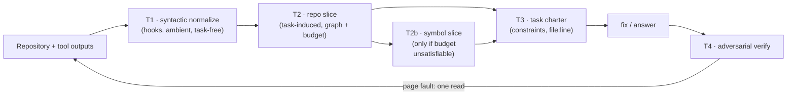
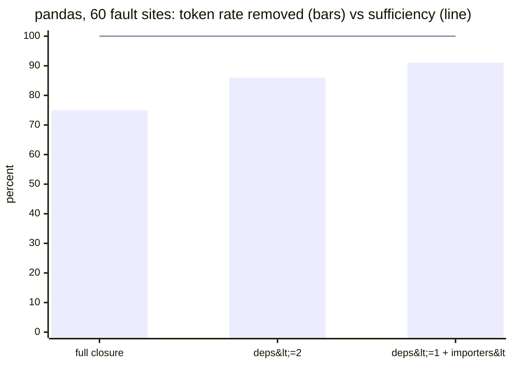

# context-kernel

**Task-induced context normalization for coding agents.**
A native Claude Code plugin (with a Codex fallback) built on one idea: the agent
should not receive the repository — it should receive a *representative of the
repository's equivalence class with respect to the task*. The task induces a
projection; everything else is built around preserving the answer, not around
shrinking text. Deterministic, stdlib-only, zero API keys — and every claim
below is backed by a measurement you can re-run.

- **117 tests**, pure stdlib, ~7s (`python3 -m unittest discover -s tests`)
- **Zero dependencies, zero API calls** — verification runs in-session
- Measured live: **−79% tokens** on a real session, **−96%** below the file-level
  floor on pandas, **46×** faster repeated slicing, **100% sufficiency** on a
  60-case fault benchmark

> This is not compression. gzip makes text smaller and unreadable;
> normalization maps a context to a canonical, smaller member of the same
> answer-equivalence class. The output is still code, still readable, still
> sufficient — by construction where possible, by measurement everywhere else.

---

## 1. The mathematical idea

*(The framing owes a debt to the operator-theoretic language of spectral theory —
projections, kernels, decompositions. It is an analogy used with care, not a claim
of isomorphism.)*

### 1.1 The answer map induces an equivalence

Let $X$ be the space of possible contexts and $Y$ the space of answers. An agent
solving a task $Q$ is a map

$$A_Q : X \longrightarrow Y$$

$A_Q$ induces an equivalence relation on contexts:

$$x \sim_Q x' \iff A_Q(x) = A_Q(x')$$

This is the load-bearing observation: **there is no such thing as "the"
context.** There are infinitely many representations equivalent under the task.
The agent does not need the document — it needs *any representative of the
document's equivalence class* $[x]_Q$. Normalization means choosing a small one.

### 1.2 Task-induced projectors

A **task-induced projector** is a map $\pi_Q : X \to X$ that is

- **idempotent**: $\pi_Q(\pi_Q(x)) = \pi_Q(x)$ — normalizing twice changes nothing;
- **answer-preserving**: $A_Q(\pi_Q(x)) = A_Q(x)$, i.e. $\pi_Q(x) \in [x]_Q$.

The subscript is not decoration. Change the question and the kernel changes:
what is invisible to "fix this KeyError" may be load-bearing for "audit the
license headers". A projector without a task index is either trivial or wrong.

Everything $\pi_Q$ removes lies in the **kernel of the task**,

$$\ker Q \;=\; \{\, \delta \in X \;:\; A_Q(x + \delta) = A_Q(x)\ \ \forall x \,\}$$

— the part of the context that cannot move the answer.

### 1.3 Two kernels: syntactic and semantic

The kernel splits into two parts of very different nature:

$$\ker_{\mathrm{syn}} \;=\; \bigcap_{Q} \ker Q \qquad\subseteq\qquad \ker Q$$

- **Syntactic kernel** — invisible to *every* task: ANSI escapes, progress-bar
  spam, consecutive duplicate lines, a file re-read that is byte-identical to
  the copy already in context. Because $\ker_{\mathrm{syn}}$ does not depend on
  $Q$, it can be projected away **ambiently**, by a hook that never needs to
  know what you are working on. That is exactly what $T_1$ is.
- **Semantic kernel** — invisible to *this* task: the 1,404 pandas files that a
  `merge` KeyError cannot see. This is the hard part; it requires knowing $Q$.
  That is what $T_2$–$T_4$ are for.

This dichotomy is why the architecture has the shape it has: task-independent
normalization runs everywhere and always; task-induced normalization runs when
there is a symptom to induce it.

### 1.4 The Task State

Define the **task state**:

$$\mathrm{TS}(Q) \;:=\; \pi_Q(C)$$

the canonical small representative of $[C]_Q$. The agent never works on the
repository; it works on the task state. Concretely, $\pi_Q$ is factored through
four operators:

$$\mathrm{TS}(Q) \;=\; \big(T_4 \circ T_3 \circ T_2 \circ T_1\big)(C)$$

In the continuous (embedding-based) picture, $Q$ spans a subspace
$\mathrm{span}(Q)$ generated by relevance probes, and each context unit $u$ is
scored by how much of its energy lives inside it:

$$\mathrm{score}(u) \;=\; \frac{\lVert \pi_Q\, e(u) \rVert}{\lVert e(u) \rVert} \;\in\; [0,1]$$

The discrete, exactly-computable picture replaces embeddings with
**reachability on the dependency graph** — which is what the shipped operators
use, because for code, structure beats similarity (we measured it; see §6).

### 1.5 Composition of projectors

When is $\pi_2 \circ \pi_1$ still answer-preserving? If both were
answer-preserving *globally*, composition would be trivial:
$A_Q(\pi_2(\pi_1 x)) = A_Q(\pi_1 x) = A_Q(x)$. The real content is that each
practical operator preserves answers only **under premises** — $T_2$'s
soundness assumes the import graph is computed from the *true* sources. So the
composition law is:

> $\pi_2 \circ \pi_1$ is answer-preserving iff the premises of $\pi_2$ hold on
> $\mathrm{Im}(\pi_1)$.

Order matters through the premises, not through the algebra. Concretely: run
$T_1$ (output normalization) *before* $T_2$ (graph slicing) and nothing breaks,
because they act on **different factors** of the context space,

$$C \;=\; C_{\mathrm{repo}} \times C_{\mathrm{dialogue}}, \qquad
T_1 = \mathrm{id} \otimes \tau_1, \quad T_2 = \tau_2 \otimes \mathrm{id}$$

and projectors on different tensor factors **commute**. Run a $T_1$-style
truncation on the *sources* before $T_2$, and $T_2$'s premise dies — which is
why this plugin never does that.

Two structural facts worth stating plainly:

- Answer-preserving projectors (with compatible premises) form a **monoid**
  under composition — closed, associative, with identity.
- They do **not** form a group. There is no $\pi_Q^{-1}$: the inverse of a
  projection is not an operator — it is an *access path*. That is the
  **page fault** (§1.6).

### 1.6 The honest weakening: page faults

Perfect answer-preservation cannot be guaranteed by static analysis alone
(dynamic imports, dependency injection, config indirection). So the guarantee
this plugin actually makes is deliberately weaker and *checkable*:

$$A_Q(\pi_Q(C)) = A_Q(C) \quad\textbf{or}\quad \text{the miss is detectable and repairable}$$

Every exclusion is a **prior, not a prohibition**. The manifest declares what
was projected away; if the agent needs an excluded piece, recovering it costs
one read — a page fault, in the OS sense. The interesting quantity is then not
"was the projection perfect?" but "what did the faults cost?" — and that is
logged, per run.

### 1.7 Rate–distortion

Every normalization trades **rate** (fraction of tokens removed) against
**distortion** (probability the answer moved out of its class). Both are
measured:

- **rate** — from the manifests and the savings log;
- **distortion** — via an *objective oracle*: take real fault sites in a repo
  (actual `raise` statements), synthesize the partial symptom a user would
  report (the caller's frame plus the error message, **not** the raise site
  itself), and check whether the projection keeps the raise site in the task
  state. If the file that throws is projected away, the answer changes with
  certainty.

The curve lives in `~/.context-kernel-pipeline.jsonl`, one JSON row per run.

---

## 2. The four operators

| | Operator | Kernel it targets | What it does | Guarantee |
|---|---|---|---|---|
| $T_1$ | **normalize** (impl. `compress.py`) | syntactic | Signal-preserving normalization of tool outputs (dedup, ANSI/progress strip, head+signal+tail elision). Plus **re-read deltas**: an unchanged re-read collapses to a 3-line marker; a changed file arrives as a unified diff against the copy already in context. | Signal lines (errors/warnings) always survive; every elision leaves a visible marker; a **canary** verifies each replacement was actually applied (§4) |
| $T_2$ | **repo slice** | semantic | Projects the repository onto the working set induced by the symptom: seeds from stack frames / quoted literals, dependency closure, bounded importers, related tests. Token **budget** (auto-derived from the live context window) selects the richest closure that fits; on monolithic repos it descends to **symbol level** ($T_{2b}$). | Sound on the static import graph; blind spots are declared exclusions + page faults; results cached by repo fingerprint **and operator hash** |
| $T_3$ | **task charter** | semantic | Extracts the constraints the fix must respect — contracts, invariants, behaviors pinned by tests — each with a mandatory `file:line` citation, ≤ ~10 items. | Every claim is citable; a stale citation is detectable |
| $T_4$ | **verifier** | — (checks, does not project) | Adversarial check of the fix against the charter, constraint by constraint; or answer-invariance judgment $A_Q(x) \overset{?}{=} A_Q(\pi_Q(x))$. | Reads ground truth via `sed`/`awk`, never through its own (normalized) Read tool |



---

## 3. Complexity and guarantee classes

Determinism is not uniform across the pipeline, and it should not be hidden.
Guarantee classes: **formal** (holds by construction), **supervised heuristic**
(heuristic, but every application is checked by an instrument), **probabilistic,
auditable** (LLM-produced, but every claim carries a citation that can be
verified deterministically), **empirical** (LLM judgment).

| Operator | Time | Space | Token effect (measured) | Guarantee class |
|---|---|---|---|---|
| $T_1$ dedup / ANSI / elision | $O(n)$ in output length | $O(n)$ | −45…−93% per output | supervised heuristic (canary) |
| $T_1$ re-read delta | $O(n)$ + SHA-1 | state ≤ ~2 MB | −98% on unchanged re-reads | formal (hash equality) |
| $T_2$ import graph + slice | $O(\text{files} + \text{imports})$; pandas 1,415 files ≈ 12 s | $O(V+E)$ | −75…−97% of repo | formal *on the static graph*; premises declared |
| $T_2$ cache hit | $O(\text{files})$ stat-only ≈ 0.26 s | 20 entries | — | formal (fingerprint + operator hash) |
| $T_{2b}$ def-use symbol slice | $O(\text{AST})$ | $O(\text{AST})$ | −96% below file-level floor | formal w.r.t. "behavior of symbol S" |
| budget resolution | $O(\text{files})$ stat | $O(1)$ | picks the point on the curve | formal (arithmetic on measured state) |
| $T_3$ charter | 1 LLM pass | — | ~10 constraints replace the diff context | probabilistic, auditable (`file:line`) |
| $T_4$ verify | 1–2 LLM passes | — | — | empirical, adversarial |

---

## 4. Measured results

All numbers below are from real runs (July 2026, Claude Code 2.1.x), reproducible
with the commands shown.

### 4.1 Syntactic normalization ($T_1$, live)

| Case | Before | After | Rate |
|---|---:|---:|---:|
| `pip3 list`, 1053 lines | 14,900 tok | 995 tok | **−93%** |
| One live session (Bash+Read+WebFetch) | 66,832 tok | 14,212 tok | **−79%** |
| Unchanged file re-read (delta) | ~2,000 tok | ~40 tok | **−98%** |

### 4.2 Sufficiency benchmark ($T_2$, objective distortion)

`bench/sufficiency_bench.py` on **pandas** (1,415 source files, 60 real raise
sites, partial symptoms — caller frame + message only):



Sufficiency stays at **100% at every depth**. The measured lesson: **distortion
is dominated by seed quality, not closure depth** — cutting depth is nearly
free. (The benchmark also earned its keep: its first run scored 85% and the
misses exposed a real seeding bug — ambiguous in-root absolute paths — which is
now fixed and regression-tested.)

On **lodash** (JavaScript, 1,048 files, a real `node` stack trace): task state
30/1048 files (**−97%**) with all four trace frames retained at every depth.

### 4.3 The monolith floor and the symbol descent ($T_{2b}$)

Measuring the budget in *tokens* (not files) exposed a structural wall:

| Level | Task state for a real pandas `KeyError` | Cost |
|---|---|---:|
| file-level minimum (11 files) | `frame.py`, `generic.py`, … | **~372k tok** — unsatisfiable |
| $T_{2b}$ symbol level | `DataFrame.merge` (32 lines), `NDFrame._get_label_or_level_values` (59 lines), `_MergeOperation.__init__`, `_get_merge_keys`, def-use slice of `merge` | **~15.4k tok** (−96%) |

Class-enclosed frames become exact method line-ranges (`sed -n 'a,bp'`);
top-level functions become backward def-use slices. The manifest ships the
extraction commands ready to run.

### 4.4 Ambient cost operator

The budget needs no human input. The $T_1$ hook snapshots the live context
occupancy from the session transcript on every tool call; a `PreToolUse` rule
injects `--budget auto` into any slicer invocation that lacks one:

```
budget: auto: session 6e2e49dc, model claude-fable-5,
window ~467k, in use ~362k, headroom ~104k -> budget 41k
```

### 4.5 Operator cache

$T_2$ is deterministic, so identical inputs are never recomputed. The cache key
is *(repo fingerprint, symptom, parameters, resolved budget, **operator hash**)*:

| | pandas (1,415 files) |
|---|---:|
| cold run | 12.0 s |
| identical re-run | **0.26 s** (46×) |

Every manifest is stamped `operatore: T2@<hash>` — change the script and the
cache invalidates itself, and telemetry knows which operator version produced
each data point.

---

## 5. The canary: measuring effect, not intent

A savings log proves the hook *computed* a replacement — not that the harness
*applied* it. The canary closes that gap: each replacement records its exact
footer (with the numbers); on the next invocation the hook checks the session
transcript for that footer. Present → verified. Absent → alarm, with the model
told in-band that savings are being overstated.

This is not theoretical. The canary's first real alarm led to **three real
bugs** in one night: the Read tool's nested response shape had silently never
been normalized; canary verification could false-positive on content that merely
*quoted* a footer; stderr-only output was destroyed by the replacement path.
All three are fixed and regression-tested — and the fix was itself produced by
running this plugin's own pipeline ($T_2 \to T_3 \to \text{fix} \to T_4$,
verdict: PASS 12/12).

---

## 6. Design principles

1. **Deterministic wherever possible.** $T_1$/$T_2$ are pure functions of their
   inputs. No learned behavior in the projection path — learning would trade
   auditability for adaptivity, and the certificate would die.
2. **Structure beats similarity for code.** Graph reachability + real seeds gave
   100% sufficiency; embedding scores are kept only as a research projector for
   prose (`span_rd.py`, repo root).
3. **Honest failure.** An unsatisfiable budget says so. Unknown tool-response
   shapes are logged (keys only) by a shape sentinel. Unknown context windows
   are estimated conservatively and printed.
4. **Mechanisms, not conventions.** Judge agents' Reads are exempted from
   normalization via the hook payload's `agent_type` (discovered empirically
   with the built-in payload tap), not via a polite instruction.
5. **Everything is measured, and the instruments get tested too.** The
   benchmark found bugs in the slicer; the canary found bugs in the harness
   contract. Instruments that never fire are decoration.

---

## 7. Installation

### Claude Code (native plugin — preferred)

From GitHub (once published):

```
/plugin marketplace add pinperepette/context-kernel
/plugin install context-kernel
```

From a local checkout (the repo root *is* a marketplace):

```
/plugin marketplace add /path/to/repo
/plugin install context-kernel@context-kernel-marketplace
```

The plugin registers by itself: the $T_1$ hooks, 5 skills
(`context-kernel:kernel-slice`, `…:kernel-repo-slice`, `…:kernel-invariants`,
`…:kernel-verify`, `…:kernel-pipeline`), 3 agents (`kernel-scout`,
`kernel-extractor`, `kernel-verifier`) and the MCP server (`kernel_slice`,
`kernel_repo_slice`). Manage with `/plugin`; verify with `/hooks` and
`python3 hooks/savings.py`.

### Codex / environments without the plugin system

```bash
bash install.sh     # idempotent; writes ~/.claude/settings.json (with backup)
```

Do **not** use both routes at once — hooks would stack (a guard prevents double
normalization, but it is waste). Codex glue lives in `codex/config.toml`.

---

## 8. Tests

```bash
cd claude-context-kernel
python3 -m unittest discover -s tests    # 117 tests, ~7s, stdlib only
```

Tests exercise the **real contract** (JSON on stdin → JSON on stdout, via
subprocess), because that is where the bugs lived:

| File | Covers |
|---|---|
| `test_compress.py` | dict/nested/string replacement shapes, stderr-only, signal preservation, no-op safety, shape sentinel, judge-agent exemption, re-read deltas, double-run guard, session attribution |
| `test_canary.py` | exact-footer verification, quoted-footer false positives, elision-marker false positives, legacy fallback, subagent pendings, TTL, `--reset-canary` |
| `test_repo_slice.py` | seeds from traceback/literals/suffix/relativization, ambiguity refusal, package-root imports, test↔source heuristic edges, budget ladder, $T_{2b}$ symbol/method slices, manifest cache & invalidation |
| `test_bench.py` | the sufficiency oracle itself (a fixture repo where the answer is known) |
| `test_pretool_rewrite.py` | quiet-flag rules, `--budget auto` injection, segment-aware insertion (pipes, fd redirects) |
| `test_savings.py`, `test_slice.py`, `test_mcp_server.py` | report parsing (5/6-field CSV), AST slicer semantics (executed, not eyeballed), MCP JSON-RPC contract |

---

## 9. Configuration

| Variable | Default | Meaning |
|---|---|---|
| `CK_MIN_TOKENS` | `800` | below this, $T_1$ never touches an output |
| `CK_TOOLS` | `Bash,Grep,Read,Glob,WebFetch` | tools $T_1$ acts on |
| `CK_AGENT_SKIP` | `kernel-verifier,kernel-extractor,kernel-scout` | agent types whose Reads are never altered |
| `CK_DELTA` / `CK_DELTA_MIN` | `1` / `200` | re-read deltas on/off, minimum size |
| `CK_CANARY` | `1` | end-to-end application check |
| `CK_SLICE_CACHE` | `1` | $T_2$ manifest cache |
| `CK_CONTEXT_WINDOW` / `CK_BUDGET_MAX` | auto / `80000` | window override, budget cap |
| `CK_PRETOOL` | `1` | command rewriting (quiet flags, budget injection) |
| `CK_TAP_FLAG` | `~/.context-kernel-tap` | `touch` it to log hook payload *keys* (never content) |
| `CK_LOG_OFF` | – | set `1` to disable all logging |

Reports: `python3 hooks/savings.py` (per-tool and per-session savings, canary
status), `python3 hooks/savings.py --reset-canary` (acknowledge investigated
failures). Curve data: `~/.context-kernel-pipeline.jsonl`.

---

## 10. Guarantees and limits, honestly

- The formal slice ($T_{2b}$ def-use, `kernel_slice`) is answer-preserving **by
  construction** with respect to "what does symbol S do" — unreachable
  top-level units cannot change S's behavior.
- The repo slice is sound on the **static** import graph. Dynamic imports,
  DI containers, config indirection are invisible to it: that is exactly what
  the page-fault model and the declared exclusions are for.
- $T_1$ normalization is heuristic but **supervised**: signal lines always
  survive, markers make every elision visible, and the canary checks that what
  you think entered the context actually did.
- The harness contract (`updatedToolOutput` and friends) is undocumented and
  can change under you. This plugin cannot prevent that — it can only *notice
  immediately* (canary) and tell you. That is a defense, not a guarantee.
- Subscription quota (5-hour windows) is not exposed by Claude Code in any
  readable form. The resource that *is* readable — and the one that actually
  constrains a task state — is the context window, and that is what the budget
  uses.

## License

MIT
